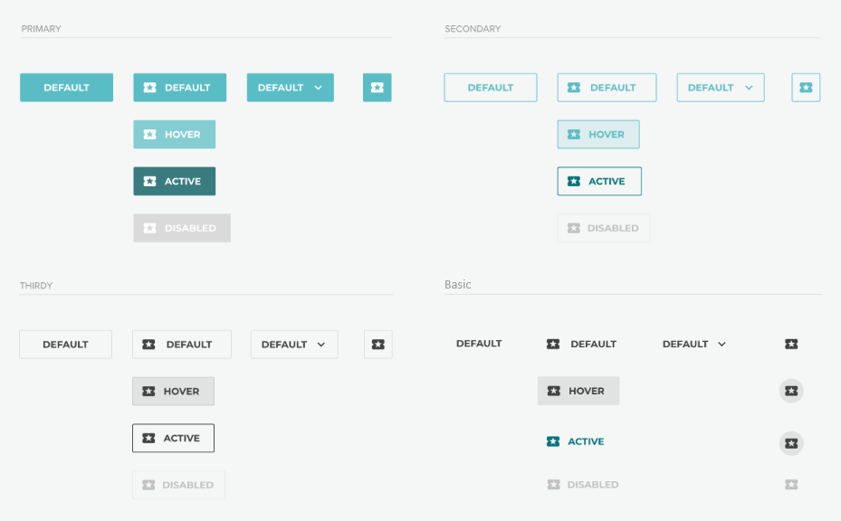
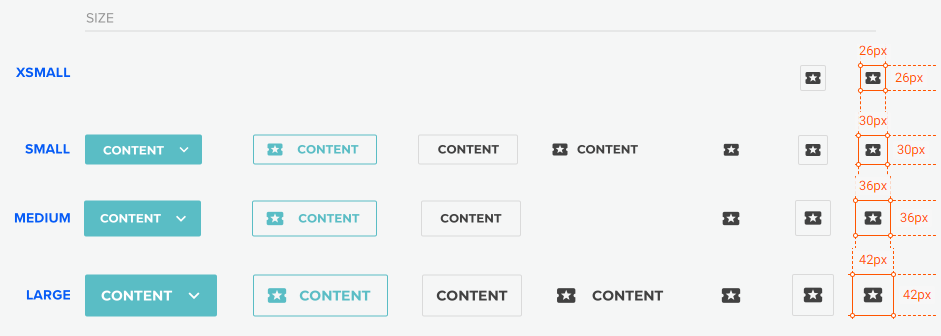

# Buttons

**Primary**

-   Normal  
    `<button mat-flat-button color="primary" class="ob-button">Primary</button>`
-   Active  
    `<button mat-flat-button color="primary" class="ob-button active">Primary</button>`
-   Disabled  
    `<button mat-flat-button color="primary" class="ob-button" disabled>Primary</button>`

**Secondary**

-   Normal  
    `<button mat-stroked-button color="primary" class="ob-button">Secondary</button>`
-   Active  
    `<button mat-stroked-button color="primary" class="ob-button active">Secondary</button>`
-   Disabled  
    `<button mat-stroked-button color="primary" class="ob-button" disabled>Secondary</button>`

**Tertiary**

-   Normal  
    `<button mat-stroked-button color="tertiary" class="ob-button">Tertiary</button>`
-   Active  
    `<button mat-stroked-button color="tertiary" class="ob-button active">Tertiary</button>`
-   Disabled  
    `<button mat-stroked-button color="tertiary" class="ob-button" disabled>Tertiary</button>`

**Basic**

-   Normal  
    `<button mat-button class="ob-button">Basic</button>`
-   Active  
    `<button mat-button class="ob-button active">Basic</button>`
-   Disabled  
    `<button mat-button class="ob-button" disabled>Basic</button>`

### Button sizes

-   XSMALL  
    `<button mat-button class="ob-button xsmall">Basic</button>`

-   SMALL  
    `<button mat-button class="ob-button small">Basic</button>`

-   MEDIUM  
    `<button mat-button class="ob-button medium">Basic</button>`

-   LARGE  
    `<button mat-button class="ob-button large">Basic</button>`
