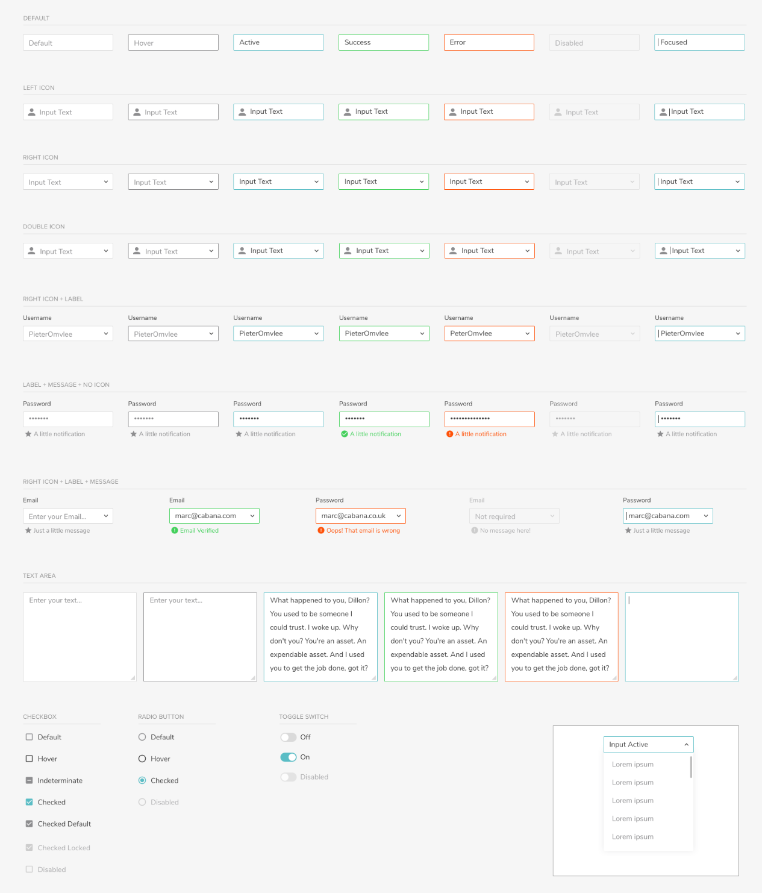

# Form Controls

[](form-controls.png)

**Form field**

-   Normal without label

```html
<mat-form-field appearance="outline" class="ob-form-field">
    <input matInput placeholder="Jhon Doe" />
</mat-form-field>
```

-   Normal with top label

```html
<mat-form-field appearance="outline" class="ob-form-field">
    <mat-label>Name</mat-label>
    <input matInput placeholder="Jhon Doe" />
</mat-form-field>
```

-   Error with bottom error message

```html
<mat-form-field appearance="outline" class="ob-form-field mat-form-field-invalid">
    <input matInput placeholder="Jhon Doe" />
    <mat-error> Name is <strong>required</strong> </mat-error>
</mat-form-field>
```

-   Success with bottom hint message

```html
<mat-form-field appearance="outline" color="success" class="ob-form-field">
    <input matInput placeholder="Jhon Doe" />
    <mat-hint>Success message</mat-hint>
</mat-form-field>
```

-   Disabled

```html
<mat-form-field appearance="outline" class="ob-form-field">
    <input matInput placeholder="Jhon Doe" disabled />
</mat-form-field>
```

-   Textarea

```html
<mat-form-field appearance="outline" class="ob-form-field">
    <textarea matInput placeholder="Address"></textarea>
    <mat-error> Address is <strong>required</strong> </mat-error>
</mat-form-field>
```

-   Select

```html
<mat-form-field appearance="outline" class="ob-form-field">
    <mat-select placeholder="State">
        <mat-option *ngFor="let state of states" [value]="state.abbreviation"> {{ state.name }} </mat-option>
    </mat-select>
</mat-form-field>
```

**Radio**

```html
<mat-radio-group>
    <mat-radio-button value="free">Free Shipping</mat-radio-button>
    <mat-radio-button value="priority">Priority Shipping</mat-radio-button>
    <mat-radio-button value="nextday">Next Day Shipping</mat-radio-button>
</mat-radio-group>
```

**Toggle**

```html
<mat-slide-toggle color="primary">Slide me!</mat-slide-toggle>
```

**Checkbox**

```html
<mat-checkbox color="primary">checkbox</mat-checkbox>
```
