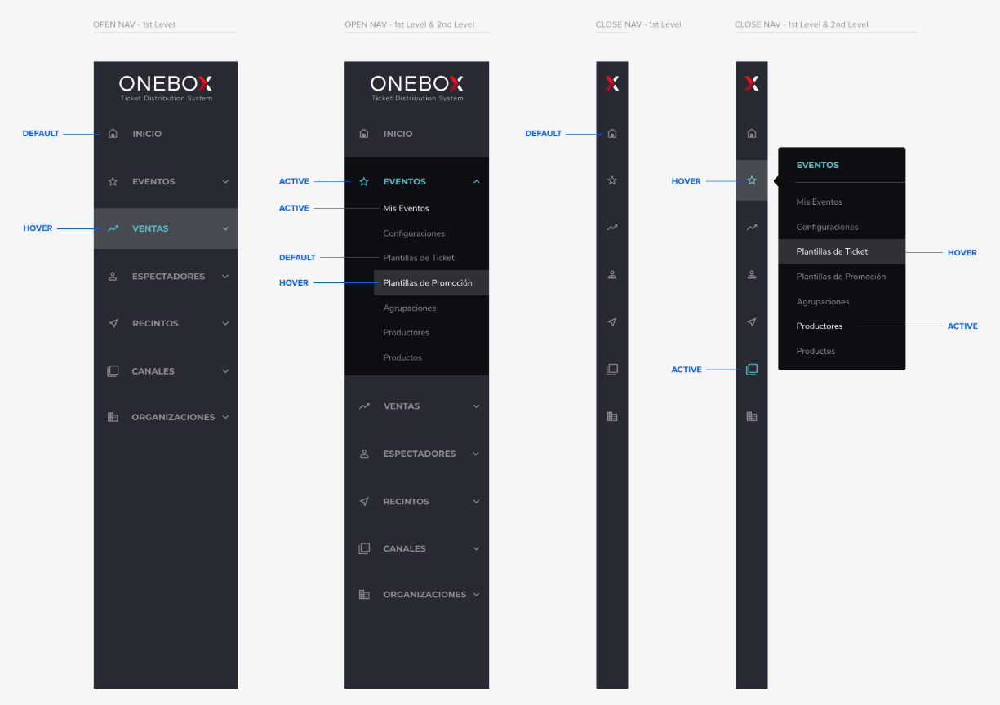

# Lateral Menu

The CPanel lateral menu is composed of 3 angular-material components:

-   [sidenav](https://material.angular.io/components/sidenav)
-   [nav-list](https://material.angular.io/components/list/overview#navigation-lists)
-   [expansion-panel](https://material.angular.io/components/expansion)
